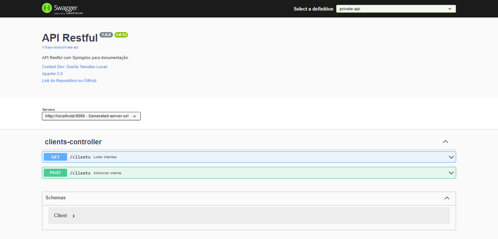

<h2 align="center">
	🚀 API Java com Spring Boot
</h2>

<p align="center">
    <a href="#-sobre-o-projeto">Sobre</a> •
    <a href="#-layout">Layout</a> • 
    <a href="#-como-executar-o-projeto">Como executar</a> • 
    <a href="#-tecnologias">Tecnologias</a> •  
    <a href="#-autor">Autor</a>
</p>

## 💻 Sobre o projeto

A API de Cadastro de Cliente é uma aplicação Java que fornece endpoints para realizar operações de cadastro e consulta de clientes em um sistema. Ela utiliza o framework Spring Boot e o Springdoc para documentação automática da API.

---

## 🎨 Layout

O projeto não possui uma interface visual, pois é uma API, mas a documentação da API é gerada automaticamente pelo Springdoc e pode ser acessada a partir da URL de documentação.
 
<p>
    <a href="https://spring.io/projects/spring-boot">
        
    </a>
</p> 

<p align="center" style="display: flex; align-items: flex-start; justify-content: center;">
    
</p>

<h4 align="center"> 
    🌐 API Java com Spring Boot 🌐
</h4>

---

## 📌 Como executar o projeto

#### ⏳ Pré-requisitos

Antes de começar, certifique-se de que você tenha o [Docker](https://www.docker.com/), o [Docker Compose](https://docs.docker.com/compose/) e o [Git](https://git-scm.com) instalados em sua máquina.

#### 🧭 Baixando o projeto

```bash
# Clone este repositório
$ git clone git@github.com:danilalucas/api-java.git
```
#### ⚙️ Configurando o projeto

```bash
# Acessar diretório
$ cd api-java
# Execute o Docker Compose para iniciar a aplicação
$ docker-compose up
```

#### A API estará disponível em http://localhost:8080/swagger-ui/index.html

---

## 🛠 Tecnologias

As seguintes ferramentas foram usadas na construção do projeto:

-   **[Java Development Kit (JDK) 17](https://www.oracle.com/java/technologies/downloads/)**
-   **[Maven](https://maven.apache.org/download.cgi)**
-   **[Docker](https://www.docker.com/)**

---

## 👩🏻‍💻 Autor

<p>
    <a href="https://github.com/danilalucas">
        
        <br />
        <b>Daníla Lucas</b>
    </a>
</p>

[](https://www.linkedin.com/in/danila-lucas/)
[](mailto:danilatlucas@gmail.com)

Feito com ❤️ por Daníla Lucas 👋🏽 [Entre em contato!](https://www.linkedin.com/in/danila-lucas/)

---